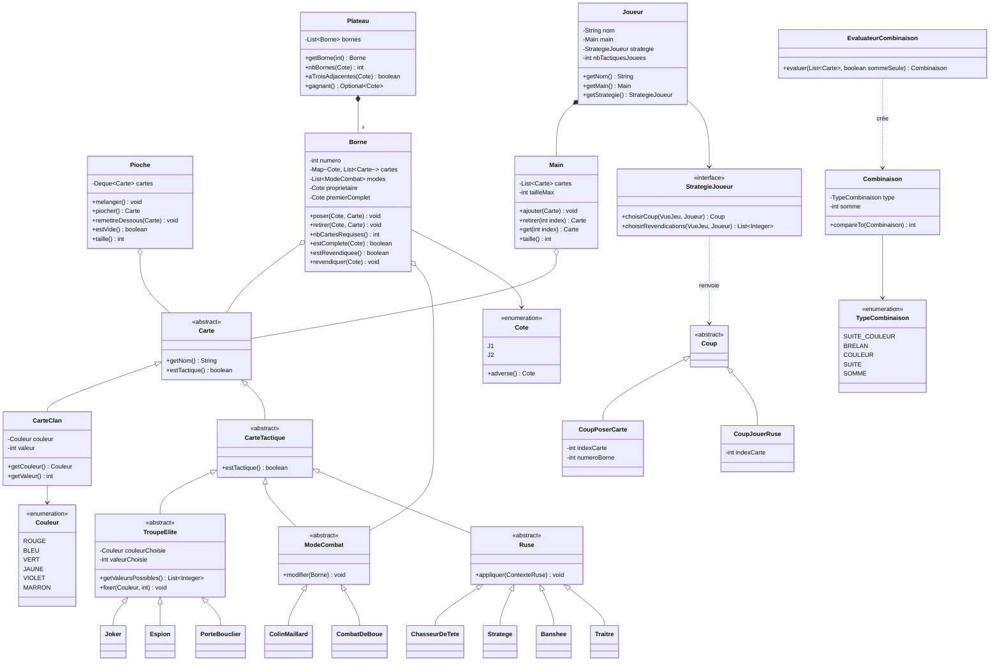
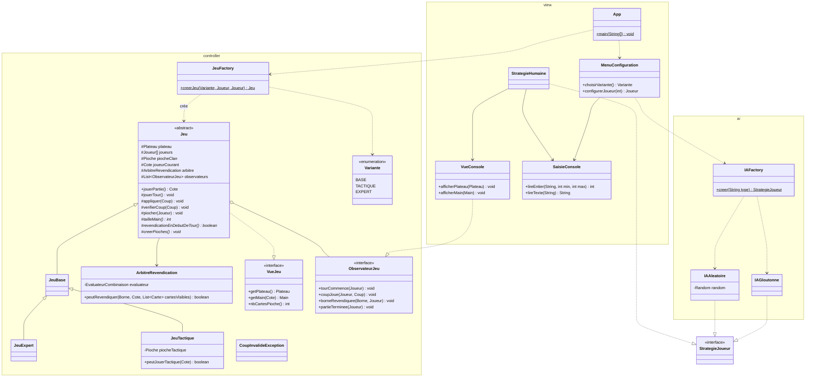

# Diagramme de classes — Schotten-Totten

Première proposition de conception. Elle couvre la variante de base, la variante tactique
et la variante experts. Elle est découpée en deux vues pour rester lisible :

1. le **modèle** (`com.schottenTotten.model`) ;
2. le **contrôleur, la vue et l'IA** (`controller`, `view`, `ai`).

---

## 1. Package `model`

---

## 2. Packages `controller`, `view` et `ai`

---

## Choix de conception

| Exigence du sujet | Réponse dans la conception |
|---|---|
| **Héritage** | Hiérarchie `Carte` → `CarteClan` / `CarteTactique` → `TroupeElite`, `ModeCombat`, `Ruse` ; hiérarchie `Jeu` → `JeuBase` → `JeuExpert`, `JeuTactique`. |
| **Polymorphisme** | Chaque `Ruse` redéfinit `appliquer()` et chaque `ModeCombat` redéfinit `modifier()`. Le `Jeu` appelle `strategie.choisirCoup()` sans savoir s'il parle à un humain ou à une IA. |
| **Encapsulation** | Une `Borne` vérifie elle-même qu'on ne pose pas plus de cartes que `nbCartesRequises()` ; la `Main` vérifie les indices ; la `Pioche` lève une exception si elle est vide. |
| **Factory** | `JeuFactory.creerJeu(Variante, ...)` instancie la bonne sous-classe de `Jeu` ; `IAFactory` fait de même pour les IA. |
| **Patron de méthode** | `Jeu.jouerPartie()` et `jouerTour()` fixent le déroulement commun ; les sous-classes ne redéfinissent que les points qui changent (taille de main, moment de la revendication, pioches). |
| **Stratégie** | `StrategieJoueur` est implémentée par `StrategieHumaine` (console) et par les IA. On ajoute une IA en écrivant une seule classe. |
| **Observateur** | Le contrôleur prévient la vue via `ObservateurJeu` : il ne dépend jamais de la console, donc on pourrait brancher une interface graphique sans le modifier. |
| **Séparation des packages** | `model` ne dépend de rien ; `controller` dépend de `model` ; `view` et `ai` dépendent de `model` et `controller`. |

### Comment étendre

- **Nouvelle IA** : créer une classe dans `ai` qui implémente `StrategieJoueur`, puis l'enregistrer dans `IAFactory`.
- **Nouvelle variante** : créer une sous-classe de `Jeu` (ou de `JeuBase`), ajouter une valeur à `Variante` et un cas dans `JeuFactory`.
- **Nouvelle carte tactique** : créer une sous-classe de `TroupeElite`, `ModeCombat` ou `Ruse` ; le reste du jeu la manipule déjà comme une `Carte`.

### Points à discuter

- `StrategieJoueur` et `Coup` sont placés dans `model` pour que `Joueur` puisse les référencer sans dépendre de `controller`. On peut aussi les déplacer dans `controller` et faire porter la stratégie par `Jeu` plutôt que par `Joueur`.
- `JeuTactique` hérite de `JeuBase` pour réutiliser ses règles. Si les deux divergent trop, on pourra les faire hériter tous les deux directement de `Jeu`.
- La revendication « par preuve », avant que l'adversaire ait posé ses trois cartes, est la partie la plus délicate : elle est isolée dans `ArbitreRevendication` pour pouvoir la tester seule avec JUnit.
